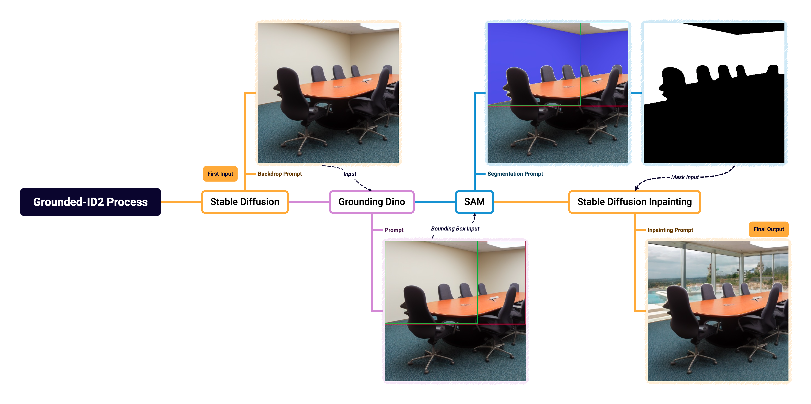

# Trans3-Vision: Transfer learning based Transformer for Transparent Object Segmentation with Grounded-ID2
**Junyang Wang, Zhongshu Liu**

Autonomous driving presents a captivating future application of AI. With the increasing accessibility of AI software and hardware, we embarked on assembling an autonomous driving vehicle with the help of online tutorials and open-source resources. Our objective was to explore the intriguing applications of autonomous driving technology within the campus environment.However, we discovered a limitation in our autonomous vehicle's online mapping ability to recognize glass walls, a material extensively used as classroom partitions on our campus. Investigation revealed that laser beams of the vehicle's LiDAR system pass through transparent glass without effective reflection, resulting in collisions with glass walls under certain conditions. As much modern architecture incorporates transparent glass materials, this issue hinders the application of autonomous driving technology around these new environments. 

In this research, we developed a training method for a machine vision AI model to detect transparent objects.

We also created a complete pipeline and methodolgy for generating unlimited training image data for any area of semantic segmentation by building upon Stable Diffusion, Grounding Dino, and SAM.





### Contribution
  - We developed an **automatic mask-labeling data generation methodology and pipeline (Integrated Pipeline of Stable Diffusion Inpainting with Grounded-SAM)**, which solves the lack of image data needed for semantic segmentation tasks from any research area, alleviates human manual work and lowers overall time consumption on creating datasets. With our methodology, we effortlessly created **Grounded-SAM Integrated Diffusion Inpainting Dataset (Grounded-ID2)**, a real-world-simulating glass segmentation dataset.
    
  - Proposed an improved Transfer learning-based Transformer for the Transparent Object Segmentation model (Tran3-Vision) to overcome the performance losses trained with combined datasets. Trans3-Vision performs better on the test data set from Trans10kv2 with a mIoU score of 75.94, **a 2.1\% increase over other state-of-the-art models**. Trans3-Vision utilized domain adaption, an optimized training process of transfer learning, in association with Grounded-ID2.

## Installation

### Stable Diffusion
For specific details, please reference [web-diffusion](https://github.com/AUTOMATIC1111/stable-diffusion-webui)

### Pipeline
The code requires `python>=3.8`, as well as `pytorch>=1.7` and `torchvision>=0.8`. Please follow the instructions [here](https://pytorch.org/get-started/locally/) to install both PyTorch and TorchVision dependencies. Installing both PyTorch and TorchVision with CUDA support is strongly recommended.
### Trans3Vision
Create environment:

```bash
conda create -n trans3-trans python=3.7
conda activate trans4trans
conda install pytorch==1.8.0 torchvision==0.9.0 torchaudio==0.8.0 cudatoolkit=11.1 -c pytorch -c conda-forge
conda install pyyaml pillow requests tqdm ipython scipy opencv-python thop tabulate
```

And install:

```bash
python .\Trans3-Vision\setup.py develop --user
```


## Grounded-ID2 Dataset
The **Grounded-ID2** (Grounded Integrated Diffusion Inpainting Dataset) process produces high quality images and transparent object masks from input prompts of only text, and it can be used to generate images and pixel-accurate masks for all objects.

<p float="left">
  
  
</p>


Find our dataset [here](https://www.dropbox.com/scl/fi/2veeevgbn8z58wbzpiega/Grounded_ID2_only.zip?rlkey=vat92ypn0ehbkurpvfbqbfwoo&dl=0).


## Trans3-Vision Model
Trans3-Vision utilizes Backpropagation and Gradient Reversal Layers. During training with Trans3-Vision, the network takes as input the source domain dataset with image classificatio labels and the target domain dataset without image classification labels, as well as domain classification labels for both source and target domain data. In other words, the source domain dataset has information about image classification labels, but the target domain dataset does not.
<p float="left">
  
</p>


